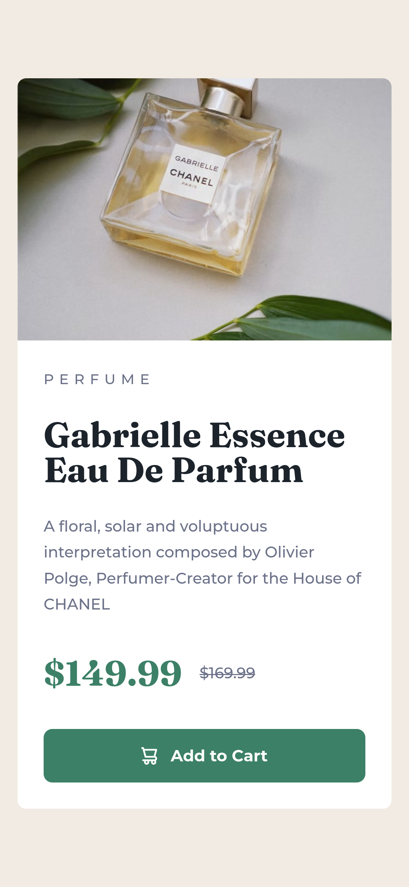

# Frontend Mentor - Product preview card component solution

This is a solution to the [Product preview card component challenge on Frontend Mentor](https://www.frontendmentor.io/challenges/product-preview-card-component-GO7UmttRfa). Frontend Mentor challenges help you improve your coding skills by building realistic projects. 

## Table of contents

- [Overview](#overview)
  - [The challenge](#the-challenge)
  - [Screenshot](#screenshot)
  - [Links](#links)
- [My process](#my-process)
  - [Built with](#built-with)
  - [What I learned](#what-i-learned)
  - [Continued development](#continued-development)
  - [Useful resources](#useful-resources)
- [Author](#author)
- [Acknowledgments](#acknowledgments)

## Overview

### The challenge

The Product preview card component challenge tasks participants with building a user interface for generating and displaying Social links within a web application. Key aspects of the challenge include:

1. Designing a visually appealing and responsive UI using HTML and SASS.
2. See hover states for interactive elements.
3. Measuring your Designing skills.

### Screenshot

- Desktop Design

- Mobile Design

	
### Links

- Solution URL: [Solution](https://www.frontendmentor.io/solutions/product-preview-card-component-solution-using-sass-mUDoJ2_9Jf)
- Live Site URL: [Live Demo](https://product-preview-card-component-sass.vercel.app/)

## My process

### Built with

- Semantic HTML5 markup
- Flexbox
- [Sass](https://sass-lang.com/documentation/) - Stylesheet language that’s compiled to CSS 
- Mobile-first workflow

### What I learned

In the Product preview card component challenge on Frontend Mentor, you likely learned several key skills and concepts, including:

1. HTML and CSS: Building a visually appealing and responsive user interface (UI) for Recipe page profile using HTML for structure and CSS for styling. This involves understanding layout techniques, such as Flexbox or Grid, to create a well-organized and visually appealing design.

   
2. Responsive Design: Creating a UI that adapts seamlessly to various screen sizes and devices, using CSS techniques like media queries to adjust layout and styling based on viewport dimensions.

3. Documentation and Best Practices: Documenting your code and adhering to best practices for code organization, naming conventions, and commenting to make your codebase more maintainable and understandable for yourself and other developers.

Overall, participating in the Product preview card component challenge on Frontend Mentor likely provided you with valuable hands-on experience in frontend development, covering HTML, CSS, JavaScript, and various related concepts and technologies.

### Useful resources

- [Sass Documentation](https://sass-lang.com/documentation/) - This helped me for many reasons. I really liked this documentation and will use it going forward.

## Author

- Frontend Mentor - [@sipanahmad](https://www.frontendmentor.io/profile/sipanahmad)
- Linkedin - [@ahmadsipan](https://www.linkedin.com/in/ahmadsipan/)
- GitHub - [@sipanahmad](https://github.com/sipanahmad)

